= Dorders: A Decentralized Orders Management Platform
:doctype: article
:author: Thibault Morin
:revnumber: 1.0.0-draft.0
:revdate: 2020-10-06
:revremark: draft version
:title-page: {title}
ifndef::backend-pdf[]
:toc:
endif::[]

[abstract]
== Abstract

`dorders` is a virtual platform helping people to exchange locally goods and services.
Its purpose is to help little and local economic agents to practice their activities without dependencies on bigger ones.
The platform relies mostly on Internet embracing a decentralized system as well as a peer-to-peer architecture.

== Introduction

////
- The closure or unattractiveness of exchange places slows down the day to day economy.
- The lack of fairness in Neoliberalism makes big fishes bigger whereas weaker are weakens.
--> act more locally, be more humanness
- but WE are humans
- so WE are part of the problems
- therefore WE are part of the solutions
--> promote local initiatives with humanness
- use an existing infrastructure
- use an existing architecture
--> a decentralized system hosted on internet
- local empowerment
- self-organization
--> a peer-to-peer architecture:
- human scale
- resilient
- sustainable pace of growth
////

The Coronavirus disease (COVID-19) Pandemic forces a part of the humanity to experience a new pace of life.

The basic protective measures, but also the more restrictive ones like the confinement, change the way humans interact socially.
Confined or crowded places should be avoided.
Social distancing is encouraged.
Hands have to be washed frequently to not contaminate goods or to not be contaminated by them.
All those measures are welcome and required to preserve the health systems and to save lives too.
However, all those changes have an impact on the day to day economy.
They impact the local producers, the shops owners ... anyone which produces or sells locally goods and services.

Basically, the usual places where to locally sell and buy goods are closed or unattractive.
Nevertheless, those places are a key factor of the day to day economy.
They are needed for sellers to show goods and buyers to be aware of them.
They are the malls, the shops, the markets, the streets ...

The Coronavirus disease Pandemic also shows weaknesses of the dominant ideology: the Neoliberalism.

This ideology emphases several policies like globalization, free trade, deregulation, privatization ...
This pandemic shows their limits.
Applying them, nations become inter-dependants about everything, even vital goods like foods, medicines, health materials, etc.
Moreover, capabilities of nations to produce goods is being also affected by the offshoring practices which destroy locally the know-how and expertise.
Finally, the model is mainly beneficial for big actors like multinationals and transnationals, especially when independents workers or small companies have to suspend their activities.

The slow down of the day to day economy as well as the lack of fairness in Neoliberalism provide signals.
Signals which could say: act more locally, be more humanness.

We are humans and as humans, we are impacted by the pandemic.
We have to take care of us and others staying at home or going outside to work.
We have to accept reduction of social interactions, unexpected delivery dates or lack of goods.
We have to deal with our beliefs, fears and wishes.

Front of a broken economy where big fishes become bigger whereas weaker are weakens, what could we do?
Could we be able to act more locally?
Could we be able to be more humanness?

In fact, there is a place to boost local initiatives far from big fishes.
As well as there is a place to transform self-interest to common-interest.
This place is close, very close to us.
It is already available at home, at work, in our smartphones or other connected devices.
It is Internet, a network of networks natively designed to host decentralized systems.

A decentralized system leverages on the empowerment of its nodes, and their self-organization.
Those building blocks help to design a solution embracing a peer-to-peer architecture.
A solution which is able to promotes local as well as human interactions.
A resilient solution able to grow and diminish at a sustainable pace.

`dorders` is the name of the described solution.
It is the concatenation of the letter *d* of decentralized with the word *orders*.

== Definition

`dorders` is a virtual platform helping people to locally exchange goods and services.

virtual:: It means the solution mostly relies on Internet.
platform:: It means the solution mostly relies on specifications, protocols and libraries rather than a unique and ready-to-use implementation.
helping:: It means the solution provides a set of heterogeneous services supporting the exchange processes of goods and services.
In other words, the solution doesn't provide a ready-to-use and global way to exchange.
people:: It means the solution mostly focuses on human interactions.
locally:: It means the solution mostly focuses on hand-to-hand exchanges.

== Domain

> *domain*: a sphere of knowledge, influence, or activity.
The subject area to which the user applies a program is the domain of the software. +
> - <<dddref>>

The domain of the `dorders` platform is the decentralized management of orders within the scope of local transactions.

The platform focuses on two main purposes:

. provide a trusted relationship between two entities
. provide services to help the orders fulfillment

The following scenarios express them in common usual situations.

=== Scenario A: Alice, Bob and the grocery

This scenario regards local shops selling goods to regular customers in face to face.

. Alice sells goods in her grocery.
. Bobs usually buys goods in the Alice's shop.
. However, Bob wants to spend as less time as possible in the shop due to protective measures.
. Therefore, Alice creates the profile in `dorders` of her shop to make its catalog available remotely.
. Alice invites Bob to be a client of her shop in `dorders`.
. So that, Bob can browse the catalog and place an order remotely.
. Once received, Alice confirms it, processes it and notifies Bob when completed.
. Finally, Bob goes to the shop, pays and comes back home with the ordered goods.

=== Scenario B: Alice, Bob and the one-way marketplace

This scenario regards ephemeral exchanges where the catalog as well as the client relationship aren't persistent.

. Alice sells vegetables every Saturday in the weekly marketplace of her town.
. Bobs usually buys vegetables at the Alice's spot.
. However, due to protective measures the authority limits the flow of persons in the marketplace.
. Therefore, Alice creates the profile in `dorders` of her business to make its weekly catalog available remotely.
. The authority provides it at the entry of the marketplace.
. So that, waiting for an entry to the marketplace, Bob can use his smartphone to browse the catalog in `dorders` and place an order remotely.
. Once received, Alice can start to process the order according to the flow of clients.
. Once Bob reaches the Alice's spot, he can quickly pick up the order and so help to improve the flow of persons.

=== Scenario C: Alice, Bob and the weekly point of sell

This scenario regards exchanges with final customers beside a main activity.

. Alice produces vegetables in her farm.
. Alice opens a point of sell in his farm for local customers.
. The point of sell opens on Friday afternoon and Saturday morning.
. However, due to protective measures the authority limits the flow of persons in local shops.
. Therefore, Alice offers to her customers to place orders remotely and pick up the items during the opening hours.
. Each Saturday afternoon, Alice publishes in `dorders` the catalog of the week and opens the order submissions.
. Each Tuesday at noon, Alice closes the order submissions.
. During the Tuesday afternoon, Alice reviews the orders and confirm them.
. On Wednesday and Thursday, Alice processes the orders and notifies the counter parts (i.e. Bob).
. Therefore, Bob knows the status of the order, and he's can find missing articles somewhere else.
. Finally, on Friday, coming back from his job, Bob can pick up his order at the point of sell.

== Concepts

> *concepts*: a general idea or understanding of something +
> - https://www.wordnik.com/words/concept[wordnik]

`dorders` involves many concepts picked from other domains related to e-commerce, trade, supply chain ...

[#concept_actor]
=== Actor

An actor represents a single person, a group of persons or an abstraction of both.
It can be an individual, an organization, a company ...

An actor exists in `dorders` throughout at least one profile.

.The Concept Diagram of Actor
image::concepts_actor.png[]

* An actor can create many profiles.
* A profile belongs to only one actor.

[#concept_profile]
=== Profile

A profile presents its actor.
It is also its entry point to interact with `dorders`.
A part of the profile is public, and the other one is private.
The purpose of the public profile is to present the actor and to reference other public data which belongs to it.
The purpose of the private profile is to store data which cannot be public or which are not ready to be.

.The Concept Diagram of Profile
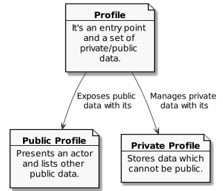

* The private profile belongs to only one profile.
* The public profile belongs to only one profile.

[#concept_peer]
=== Peer

A peer is a link between the physical world and the virtual one.
For an actor, a peer hosts profiles data.
It also provides an interface to manipulate them.
For the network, it is a cache of public data which can be used by any other peers.

.The Concept Diagram of Peer

* A peer only hosts profiles of its actor.
* A profile can be hosted by one or many peers.
* A profile must be at least hosted by one alive peer to exist.

[#concept_contact]
=== Contact

A contact is the reference of a public profile.
It is like an entry of an address book.

.The Concept Diagram of Contact

* A profile can create many contacts.
* A contact belongs to only one profile.
* A contact references another profile.

[#concept_relationship]
=== Relationship

A relationship is a link between two profiles.
It is an agreement to share mutual data.

.The Concept Diagram of Relationship
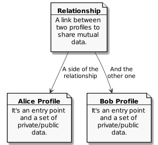

* A relationship references two profiles.
* A profile can be referenced by many relationships.

[#concept_catalog]
=== Catalog

A catalog is a comprehensive list of the products.
This contains all the data related to the products including product images, descriptions, specifications, price and user reviews. <<magglo>>

Labels can be used to mark products in order to group them or to find them accurately.

.The Concept Diagram of Catalog
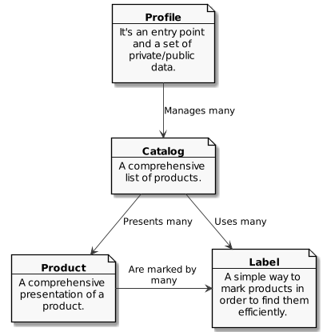

* A profile can create many catalogs.
* A catalog belongs to only one profile.
* A catalog can create many labels.
* A label belongs to only one catalog.
* A catalog can create many products.
* A product belongs to only one catalog.
* A product can be marked by many labels.

[#concept_order]
=== Order

An order is an instruction created by a profile (i.e. the consumer) of a relationship to get a set of products picked from the catalogs of the other one (i.e. the provider).
An order has a list of items which reference products.

.The Concept Diagram of Order

* A relationship can create many orders.
* An order has a consumer.
* An order has a provider.
* An order can contain many items.
* An item is a reference to a product.

== Characteristics

> *characteristic*: a prominent attribute or aspect of something. +
> - https://www.wordnik.com/words/characteristic[wordnik]

In order to provide a solution which is _more local_ and _more human_, `dorders` embraces key characteristics.

////
--> truthfulness
--> elastic
--> privacy

--> human scale
--> local empowerment
--> self-organization
////

[#characteristics_truthfulness]
=== Truthfulness

> *truthfulness*: the character of being truthful: as, the truthfulness of a person or of a statement. +
> - https://www.wordnik.com/words/truthfulness[wordnik]

In order to safely practice exchanges, each part of the relationship must trust the other one.

In `dorders`, the creation context of a <<concept_relationship>> leads to its level of truthfulness.
The value is not mutual among sides of the relationship, each one own its level of truthfulness.
The creation process initialize the value.
Then, the level can be manually updated.

When both sides, together, trigger and confirm manually the relationship, then the level of truthfulness is by default _high_ for both.
It can be the case when the creation context involves mobile applications exchanging data locally in realtime, for instance scanning a QR-Code or establishing a Bluetooth connection.

When only one side triggers manually the creation of a relationship and then wait for the confirmation from the other side, so then, once confirmed, the level of truthfulness is by default _moderate_ for both side.
It can be the case when the creation context involves an "invitation" which can be accepted or ignored, for instance a URL sent by email or instant messaging.

When only one side triggers automatically the creation as well as the confirmation of a relationship, then the level of truthfulness is by default _low_ for both sides.
It can be the case when the creation context involves a public portal where people can create their "invitations" them-self, for instance a web form sending an "invitation" on submission.

Another source of truthfulness is the history of a relationship.
It contains all significant messages which has been exchanged within it.
The recorded messages cannot be updated or deleted, they are immutable.
Therefore, the history of a relationship can also be used as an audit log of the relationship.
This pattern is in fact the building block of the data management in `dorders`: everything can be audited.

[#characteristics_elastic]
=== Elasticity

> *elasticity*: the throughput of a system scales up or down automatically to meet varying demand as resource is proportionally added or removed. +
> - <<reaglo>>

`dorders` promotes a decentralized system based on a peer-to-peer architecture.
Therefore, the platform involves autonomous and self-organized xref:concept_actor[Actors].
An actor owns at least one xref:concept_peer[Peer] within the `dorders` network.
A peer hosts xref:concept_profile[Profiles] of the actor as well as public data fetched from other peers.

==== Profile duplication

A profile can be duplicated in many peers, so that the actor can access to them from different interfaces, places ...
The profile duplication can also be used for backup purpose.

The actor _Alice_ uses two peers:

. her smartphone, the _Alice Smartphone_
. and the grocery's laptop, the _Grocery Laptop_

_Alice_ has two profiles:

. her personal profile, the _Alice Profile_
. and the profile of her grocery, the _Grocery Profile_

As shown below, both peers host _Grocery Profile_ but only _Alice Smartphone_ hosts _Alice Profile_.

.Elasticity: hierarchy view of Alice and her profiles

At her own pace, _Alice_ can create or destroy peers.
She can also manage their profiles with the same manner.

If tomorrow, _Alice_ buys a new smartphone (_Alice Smartphone New_), she will import the profiles from _Alice Smartphone_ to _Alice Smartphone New_.
As shown below, after the import, both smartphones will have the same content.

.Elasticity: hierarchy view of Alice and her profiles with the new smartphone

She can now use _Alice Smartphone New_ and reset to factory settings _Alice Smartphone_ in order to recycle it.

In this layout, _Alice_ is also safe if _Grocery Laptop_ suddenly dead, because _Grocery Profile_ is at least replicated by her smartphone.
So that, after the purchase of a new laptop, _Alice_ will be able to replicate _Grocery Profile_ in this new peer from her smartphone.

==== Layered connections

The elasticity of `dorders` happens in three main layers.

. The network of actors is the first layer.
. The network of peers managed by actors is the second layer.
. The network of profiles hosted by peers is the last layer.

In each layer, nodes can appear as well as disappear at any time.
Actors are free to create, maintain or leave a relationship.
Actors are free to create or destroy peers.
Finally, actors are free to create or remove profiles from their peers.

.Elasticity: layered view of networks

[#characteristics_privacy]
=== Privacy

> **privacy**: the state or condition of being free from being observed or disturbed by other people. +
> - https://www.wordnik.com/words/privacy[wordnik]

`dorders` recognizes only three levels of privacy: _private_, _relational_ and _public_.
A _relational_ or _public_ data cannot become _private_, because by essence shared with other actors.

Due to the xref:characteristics_truthfulness[truthfulness characteristic], and especially its immutability about data, `dorders` can only `create` and `read` data physically (c.f. the CRUD functions).
Therefore, append-only logs provide the illusion of mutations, i.e the `update` and `delete` functions.
That means, already committed data of the levels _relational_ and _public_ cannot be _deleted_ or _updated_.

==== Private

Private data can only be get and mutated by their owner.
For instance, the private part of a profile can only be get and mutates by its actor.

A private data still remains at the _private_ scope as long as its actor makes it _relational_ or _public_.
For instance, by default a created catalog is _private_ and hosted in the private profile.
Once published, the catalog becomes public and therefore hosted in the public profile.

==== Relational

Relational data can only be get and mutated by the participants of the underlying <<Relationship>>.
For instance, a relationship hosts all data related to its orders.
Only both sides of the relationship can get and mutate them.

==== Public

Public data can be seen by anyone, however only its actor can mutate them.
For instance, a public catalog can be seen by anyone, but only the actor of the related profile can update it.

=== Interoperability

> **interoperability**: the ability to exchange and use information (usually in a large heterogeneous network made up of several local area networks). +
> - https://www.wordnik.com/words/privacy[wordnik]

The `dorders` platform inter-connects xref:concept_peer[Peers] in order to exchange data.

The solution relies on existing communication protocols to create and maintain the connection between peers as well as the transit of data.
About ready-to-use technologies, two candidates are available.
The first one is IPFS <<ipfs>> with the addition of OrbitDB <<orbitdb>>.
The second one is Blockstack <<blockstack>>.
Both approaches emphases the previous characteristic: <<characteristics_truthfulness>>, <<characteristics_elastic>> and <<characteristics_privacy>>.

The solution relies on existing solutions as common data format.
About ready-to-use technologies, many candidates are available.
The closer solutions to the `dorders` domain are :

- Schema.org <<schema>> for the vocabulary
- JSON for Linking Data (JSON-LD) <<jsonld>> for the encoding/decoding

== Bounded Contexts

> *bounded context*: A description of a boundary (typically a subsystem, or the work of a particular team) within which a particular model is defined and applicable. +
> - <<dddref>>

The design of the following bounded contexts emerges applying the Domain Development Design <<ddd>> approach.
The underlying models are mainly expressed using the EventStorming <<evstorm>> notations.
They also integrate the two following patterns: CQRS <<cqrs>> and Hexagonal Architecture <<hexarch>>.

[#boudned_context_peer]
=== Peer

At any time a peer can be available or unavailable.
A peer is available because it has been _started_.
On the other hand, a peer is unavailable because it has been _stopped_ or simply never started.

According the point of view, a peer can be _local_ or _remote_.
The present design focuses only on the _local peer_.

==== Start the local peer

The command `StartLocalPeer` starts a `LocalPeer`.
Once the peer is started, the event `LocalPeerStarted` is generated.

.EventStorming Diagram of Peer - start the local peer
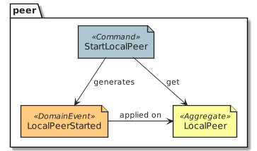

[scenario-start_local_peer-1]
....
Scenario: start the local peer
GIVEN a stopped local peer
WHEN StartLocalPeer is executed
THEN the event LocalPeerStarted is published
....

[scenario-start_local_peer-2]
....
Scenario: fail to start the local peer
GIVEN a started local peer
WHEN StartLocalPeer is executed
THEN the execution fails
....

==== Stop the local peer

The command `StopLocalPeer` stops a `LocalPeer`.
Once the peer is started, the event `LocalPeerStopped` is generated.

.EventStorming Diagram of Peer - start the local peer
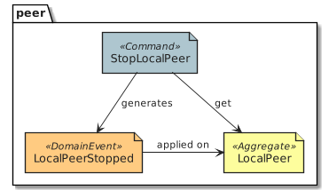

[scenario-stop_local_peer-1]
....
Scenario: stop the local peer
GIVEN a stopped local peer
WHEN StopLocalPeer is executed
THEN the event LocalPeerStopped is published
....

[scenario-stop_local_peer-2]
....
Scenario: fail to stop the local peer
GIVEN a stopped local peer
WHEN StopLocalPeer is executed
THEN the execution fails
....

[#boudned_context_profile]
=== Profile

==== Create a profile

[story-create_profile]
....
As user,
I want to create a profile,
So that, I could exist in dorder
....

The command `CreateProfile` creates a new `Profile` from scratch in a `LocalPeer`.
The creation process leads to the generation of the following two events: `ProfileCreated` and `ProfileCardUpdated`.
The command returns the `ProfileId` of the created `Profile`.

.EventStorming Diagram of Profile - create a profile

[scenario-create_profile_from_scratch]
....
Scenario: create a profile from scratch
GIVEN the started peers PeerA
WHEN CreateProfile is executed on PeerA
THEN the event ProfileCreated is published
AND  the event ProfileCardUpdated is published
....

==== Import a profile

[story-import_profile]
....
As user,
I want to import an existing profile hosted in another device,
So that, I could use the same profile in the other device
....

The command `ImportProfile` imports a `Profile` from its `SerializedProfileReference` in a `LocalPeer`. 
The import process leads to the generation of the following event: `ProfileCreated`.
The command returns the `ProfileId` of the created `Profile`.

The deserialization of the `SerializedProfileReference` is delegated to the service `ProfileReferenceDeserializer`.

.EventStorming Diagram of Profile - import a profile

[scenario-import_profile_from_reference]
....
Scenario: import a profile from its reference
GIVEN the started peers PeerA and PeerB
AND the profile ProfileA with the reference ProfileAReference
AND the profile ProfileA hosted by the PeerA
WHEN ImportProfile is executed with ProfileAReference on PeerB
THEN the event ProfileCreated is published by PeerB
....

==== Update the profile card

[story-update_profile_card]
....
As user,
I want to update the card of one of my profile
So that, I could adapt it 
....

The command `UpdateProfileCard` updates the card of a `Profile` on a `LocalPeer`.
The update process leads to the generation of the following event: `ProfileCardUpdated`.

.EventStorming Diagram of Profile - update the profile card
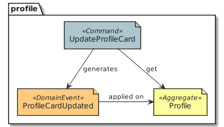

[scenario-update_profile_card]
....
Scenario: update the card of a profile
GIVEN the started peers PeerA
AND the profile ProfileA hosted by the PeerA
WHEN UpdateProfileCard is executed
THEN the event ProfileCardUpdated is published
....

==== Delete a profile

[story-delete_profile]
....
As user,
I want to delete a profile on my current device
So that, it won't be anymore available from the device
....

The command `DeleteProfile` deletes a `Profile` on a `LocalPeer`.
The update process leads to the generation of the following event: `ProfileDeleted`.

.EventStorming Diagram of Profile - delete a profile

[scenario-delete_profile]
....
Scenario: delete a profile
GIVEN the started peers PeerA
AND the profile ProfileA hosted by the PeerA
WHEN DeleteProfile is executed
THEN the event ProfileDeleted is published
....

==== Get the Serialized Profile Reference

[story-GetSerializedProfileReference]
....
As user,
I want to get the serialized value of a profile reference
So that, I could use to import the profile in another peer
....

The query `GetSerializedProfileReference` returns the `SerializedProfileReference` a `Profile` located in a `LocalPeer`.

The serialization of the `ProfileReference` is delegated to the service `ProfileReferenceSerializer`.

.EventStorming Diagram of Profile - get a serialized profile reference
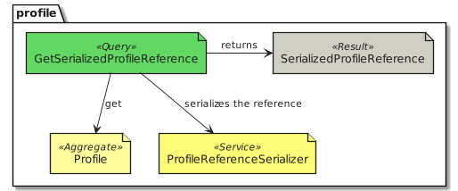

[scenario-GetSerializedProfileReference]
....
Scenario: get a serialized profile reference
GIVEN the started peers PeerA
AND the profile ProfileA hosted by the PeerA
WHEN GetSerializedProfileReference is called 
THEN the serialized profile reference is returned
....

==== Load profiles

[story-load_profiles]
....
As user,
I want to have synchronized profiles once my device is started
So that, I won't miss important information
And my device will be able to provide the most accurate data
....

Once a `LocalPeer` is online (i.e. _started_), the hosted `Profile` have to be loaded.
So that, their contents will be available for other `dorders` peers.

The process starts on the event `LocalPeerStarted`.
For each hosted `Profile`, the process creates its aggregate and generates the related event `ProfileCreated`.
Once all profiles are loaded, the process generates the event `ProfilesLoaded`.

.EventStorming Diagram of Profile - load profiles
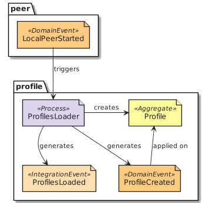

[scenario-load_hosted_profiles]
....
Scenario: load hosted profiles on startup
GIVEN the stopped peer PeerA
AND the profiles ProfileA, ProfileB and ProfileC hosted on PeerA
WHEN PeerA is started
THEN an event ProfileCreated is published for each hosted profiles 
THEN an event ProfilesLoaded is published 
....

==== Synchronize profiles

[story-ProfileSynchronizer]
....
As user,
I want to have an automatic synchronization of the content of hosted profiles among my devices 
So that, I won't miss important information
And my devices will be able to provide the most accurate data at any time
....

The data of a profile can be updated at any time by any peers which hosts it.
The peer-to-peer technology used to implement the model should provide the mechanism to synchronize profile data among the peers.

The process `ProfileSynchronizer` is responsible to deal with the ongoing synchronizations.

===== Manage the ongoing synchronizations 

For each published event `ProfileCreated`, the process get the related aggregate and delegates to `ProfileSynchronizerService` the management of the synchronization.
Each time a profile is _synchronized_, an event `ProfileSynchronized` is generated.

.EventStorming Diagram of Profile - manage the ongoing synchronizations
image::design_profile_eventstorming_synchronize_profiles_manage.png[]

[scenario-ProfileSynchronizer_start]
....
Scenario: synchronize profile's card
GIVEN the started peers PeerA and PeerB
AND the profiles ProfileA hosted on PeerA and PeerB
WHEN ProfileA's card is updated on PeerA
THEN an event ProfileSynchronized is published on PeerB
....

===== Stop the ongoing synchronizations 

When the `LocalPeer` is stopped, the process notifies `ProfileSynchronizerService` to stop the management of the ongoing synchronizations.
When all ongoing synchronizations are stopped, the event `ProfilesSynchronizationStopped` is generated.

.EventStorming Diagram of Profile - stop the ongoing synchronizations
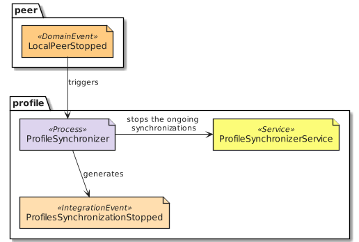

[scenario-ProfileSynchronizer_stop]
....
Scenario: stop the ongoing synchronizations
GIVEN the started peers PeerA
AND the profiles ProfileA hosted on PeerA
WHEN PeerA is stopped
THEN an event ProfilesSynchronizationStopped is published
....

[#boudned_context_contact]
=== Contact

==== Add a contact

[story-add_contact]
....
As user,
I want to add contacts in the "contact book" of my profiles
So that, I could quickly access to the public profile of others dorders actors
....

The command `AddContact` initiates the addition of a new contact.
Its logic creates and persists a new `Contact` aggregate.
The publication of the event `ContactCreated` indicates the completion of the command.

.EventStorming Diagram of Contact - add a contact
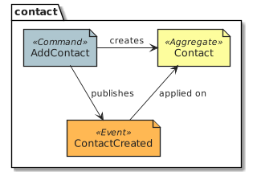

==== Rename a contact

[story-rename_contact]
....
As user,
I want to rename contacts of my profiles' "contact book" 
So that, I could make the contact more personal
....

The command `RenameContact` initiates the update of a contact.
Its logic changes the name of a `Contact` aggregate and persists it.
The publication of the event `ContactRenamed` indicates the completion of the command.

.EventStorming Diagram of Contact - rename a contact
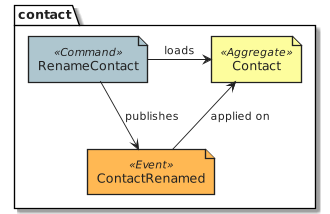

==== Remove a contact

[story-rename_contact]
....
As user,
I want to remove contacts of my profiles' "contact book" 
So that, I could discard the useless ones 
....

The command `RemoveContact` initiates the deletion of a contact.
Its logic physically deletes a `Contact` aggregate.
The publication of the event `ContactDeleted` indicates the completion of the command.

.EventStorming Diagram of Contact - remove a contact
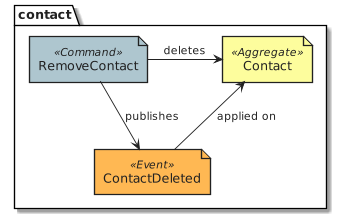

==== Load contacts

[story-load_profiles]
....
As user,
I want to have synchronized contacts 
When my device is started
....

[story-load_profiles]
....
As user,
I want to have synchronized contacts
When a profile is imported
....

Once a `PrivateProfile` aggregate is _created_, the related contacts have to be loaded.

The process starts on the event `ProfileCreated`.
For each contact related to the created profile, the process creates the `Contact` aggregate.
The publication of the event `ContactsLoaded` indicates the completion of the process.

.EventStorming Diagram of Contact - load contacts
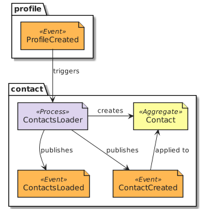

==== Synchronize the contact's data

[story-load_profiles]
....
As user,
I want to have at any time the most updated data for each contact
....

Once a `Contact` aggregate is _created_, the related data have to be monitored.

The process starts on the event `ContactCreated`.
Then the process delegates to the service `ContactSynchronizationService` the monitoring of the ongoing synchronization.
The service publishes the event `ContactSynchronized` each time data are synchronized.

.EventStorming Diagram of Contact - synchronize the contact's data
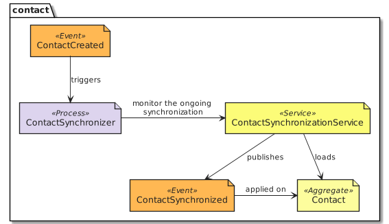

==== Synchronize the contact lists

[story-load_profiles]
....
As user,
I want to have my contact lists synchronized among my devices
....

Once a contact list is _mutated_, the changes have to be handled on peers which replicates the same profile.

The process starts on the event `ProfileSynchronized`.
Then, the process delegates to the service `ContactSynchronizationService` the merging logic.
The publication of the event `ContactsSynchronized` indicates the completion of the process.

.EventStorming Diagram of Contact - synchronize the contact lists
image::design_contact_eventstorming_contacts_synchronizer.png[]

==== Clear contacts's data

Once a `PrivateProfile` aggregate is _deleted_, the related contacts's data have to be deleted as well.

The process starts on the event `ProfileDeleted`.
For each contact related to the deleted profile, the process deletes the `Contact` aggregate and publishes the related event `ContactDeleted`.
The publication of the event `ContactsDeleted` indicates the completion of the process.

.EventStorming Diagram of Contact - clear contacts's data
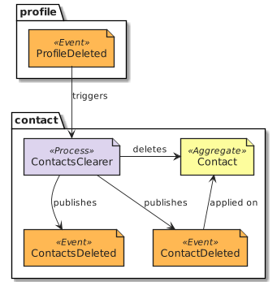

== Prototypes

=== Demonstration

The demonstration prototype implements the `dorders` model from an in memory and volatile point of view.

Its main purpose is to validate the `dorders` model.
The second purpose is to provide easily a network of `dorders` nodes for testing activities.

.Container diagram <<c4m>> for the demonstration prototype
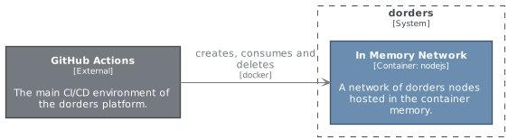

// === IPFS and OrbitDB
// https://github.com/ipfs/ipfs
// === IPFS alone
// https://github.com/ipfs/ipfs
// https://github.com/orbitdb/welcome
// === Blockstack
// https://blockstack.org/

[appendix]
== Object Oriented Design

[#ooo_peer]
=== Module Peer

The aggregate `LocalPeer` is an interface which extends the interface `Peer`.

The factory `LocalPeerFactory` is an interface which is responsible to create instances of `LocalPeer`.

.UML Class Diagram of the peer module
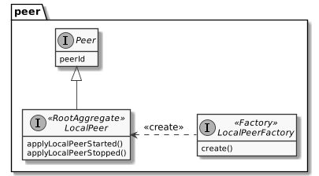

[#ooo_profile]
=== Module Profile

A part of a _profile_ is _public_, and the other one is _private_.
In the present design, the _public_ side is a subset of the _private_ one.

The aggregate `PrivateProfile` is an interface which extends the interface `Profile`.
On the other side, the value object `PublicProfile` is also an interface which extends the same interface `Profile`.

The factory `PrivateProfileFactory` is an interface which is responsible to create instances of `PrivateProfile`.

The repository `PrivateProfileRepository` is an interface which is responsible to persist and load instances of `PrivateProfile`.

The service `ProfileSynchronizerService` is an interface which is responsible to start and/or monitor the peer-to-peer synchronization private profiles.

.UML Class Diagram of the profile module
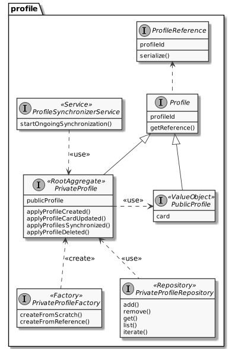

[#ooo_contact]
=== Module Contact

The aggregate `Contact` is an interface which relies on the value object `PublicProfile` to expose the public profile of the related profile.

The factory `ContactFactory` is an interface which is responsible to create instances of `Contact`.

The repository `ContactRepository` is an interface which is responsible to persist and load instances of `Contact`.

The service `ContactSynchronizationService` is an interface which is responsible to manage the ongoing synchronizations.

.UML Class Diagram of the contact module
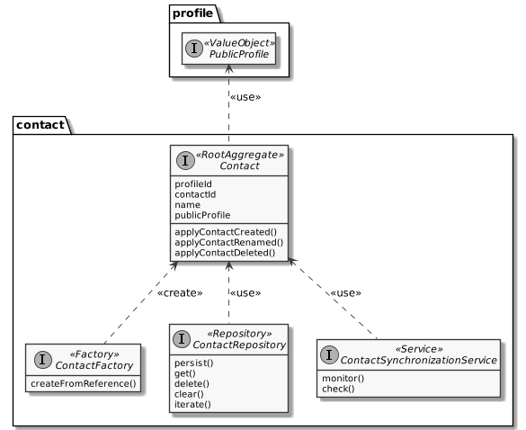

[glossary]
== Glossary

Command Query Responsibility Segregation (CQRS):: It is a software pattern which help to implement a complex domain splitting it in two pars: the command model which mutates the state of the system, and the query model which retrieves the state of the system. <<cqrs>>
Create, Read, Update and Delete (CRUD):: It refers to the four major functions implemented in database applications.
The CRUD functions are the user interfaces to databases, as they permit users to create, view, modify and alter data.
CRUD works on entities in databases and manipulates these entities.
Any simple database table enforces CRUD constraints. <<techopedia>>
Decentralized System:: A decentralized system is an interconnected information system in which no single entity is the sole authority. <<computerhope>>
Hexagonal Architecture:: It is an architectural pattern which helps to isolate the components of an application. <<hexarch>>
Internet:: The internet is a globally connected network system that uses TCP/IP to transmit data via various types of media.
The internet is a network of global exchanges – including private, public, business, academic and government networks – connected by guided, wireless and fiber-optic technologies. <<techopedia>>
Order Fulfillment:: In ecommerce terminology, this is a sequence of steps a company undertakes to process the order from the point of sale to the delivery of goods with customer satisfaction.
Fulfillment is also commonly known as Order fulfillment. <<magglo>>
P2P Architecture:: It is a commonly used computer networking architecture in which each workstation, or node, has the same capabilities and responsibilities. <<techopedia>>

[bibliography]
== Bibliography

[.lead]
Normative

- [[[jsonld]]] JSON-LD 1.1 - A JSON-based Serialization for Linked Data ~ https://www.w3.org/TR/json-ld11/[]
- [[[schema]]] Schema.org - Living Standard ~ https://schema.org[]

[.lead]
Technologies

- [[[ipfs]]] InterPlanetary File System ~ https://github.com/ipfs/ipfs[]
- [[[orbitdb]]] OrbitDB ~ https://github.com/orbitdb/welcome[]
- [[[blockstack]]] Blockstack ~ https://blockstack.org/[]

[.lead]
References

- [[[a4d1]]] Technical leadership and the balance with agility ~ Simon Brown 2019 ~ https://leanpub.com/software-architecture-for-developers[]
- [[[a4d2]]] Visualise, document and explore your software architecture ~ Simon Brown 2019 ~ https://leanpub.com/visualising-software-architecture[]
- [[[c4m]]] The C4 model for visualising software architecture ~ Simon Brown ~ https://c4model.com[]
- [[[cqrs]]] Command Query Responsibility Segregation ~ Martin Fowler ~ https://martinfowler.com/bliki/CQRS.html[]
- [[[ddd]]] Domain-Driven Design: Tackling Complexity in the Heart of Software ~ Eric Evans 2003
- [[[dddref]]] Domain-Driven Design Reference ~ Eric Evans 2015 ~ https://domainlanguage.com/wp-content/uploads/2016/05/DDD_Reference_2015-03.pdf[]
- [[[evstorm]]] Introducing EventStorming ~ Alberto Brandolini ~ https://leanpub.com/introducing_eventstorming[]
- [[[hexarch]]] Hexagonal Architecture ~ https://web.archive.org/web/20180822100852/http://alistair.cockburn.us/Hexagonal+architecture[]
- [[[reaman]]] The Reactive Manifesto ~ https://www.reactivemanifesto.org[]

[.lead]
Glossaries

- [[[computerhope]]] Computer terms, dictionary, and glossary ~ https://www.computerhope.com[]
- [[[magglo]]] Magenticians Ecommerce Glossary ~ https://magenticians.com/ecommerce-glossary[]
- [[[reaglo]]] The Reactive Manifesto Glossary ~ https://www.reactivemanifesto.org/glossary[]
- [[[techopedia]]] Technology Dictionary ~ https://www.techopedia.com[]
